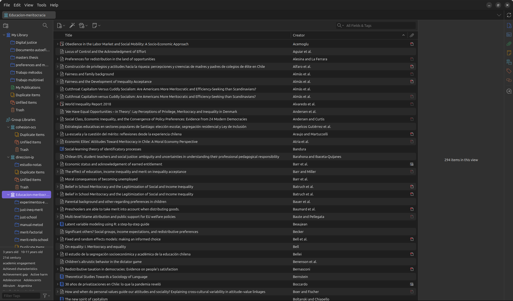
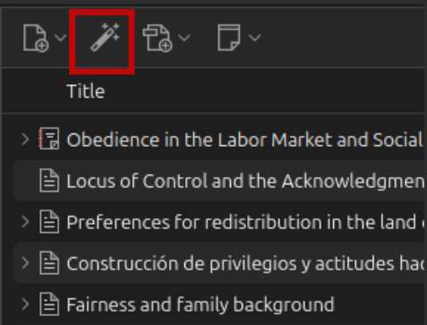
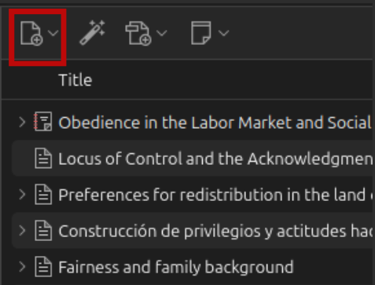
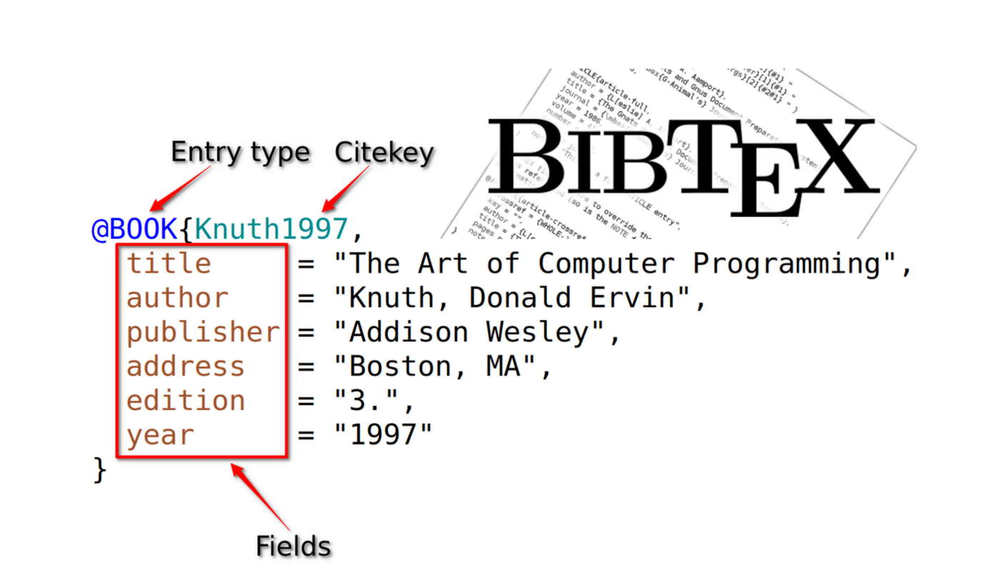
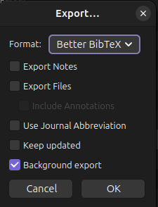
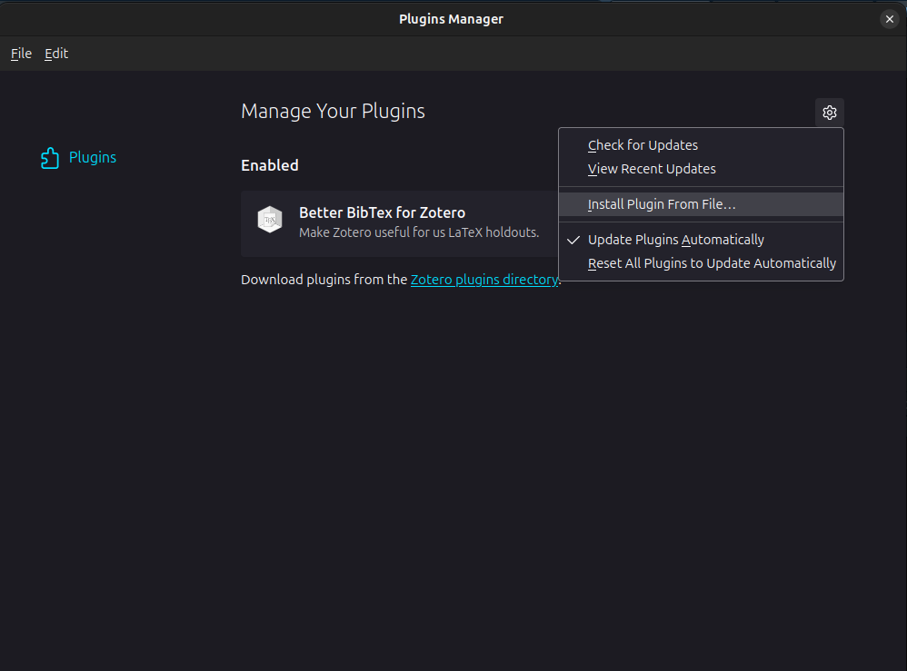
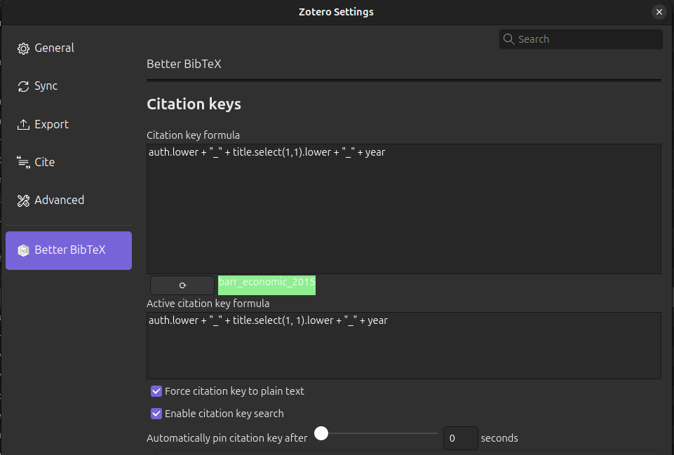
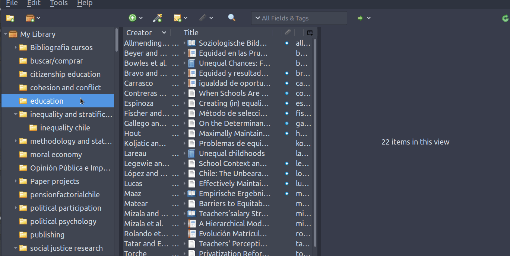

---
format:
  revealjs:
    theme: workshop.scss
    transition: slide
    transition-speed: slow
    slide-number: true
    show-slide-number: print
editor: source  
---
# Módulo 5 - Automatización de referencias con Zotero {background-color="#a81014" .white style="font-size:30px; display:flex; align-items:left; justify-content:center; height:70vh; font-weight:700;"}

<br>
<br>

<p align="right">
  
</p>


## Contenidos 

:::{.incremental style="font-size:55px; font-weight:bold;"}

- 1.- Gestores de referencias
- 2.- Citas en texto plano
- 3.- Automatización de referencias bibliográficas

:::

# Gestores de referencias {background-color="#a81014"}

## Referencias: un trabajo de hormiga 

- Todo trabajo de investigación necesita un apartado de referencias, el cual usualmente es construido a modo manual

- Elaborar las referencias de esta manera puede transformarse en una tarea laboriosa y, a veces, estresante

- Existen herramientas que pueden amenizar en gran medida este proceso

## Gestores de referencias

- Los software especializados en referencias permiten recolectar, organizar y compartir estos elementos

- A día de hoy, existe una gran oferta en cuanto a programas de referencias bibliográficas: Endnote, Mendeley, Refworks, Zotero

- De aquí en adelante trabajaremos con Zotero, software libre y de código abierto

## Zotero

- Para instalar: [https://www.zotero.org](zotero.org)

- Además, se recomienda instalar su extensión de [Google Chrome](https://chromewebstore.google.com/detail/zotero-connector/ekhagklcjbdpajgpjgmbionohlpdbjgc?utm_source=ext_app_menu), la cual permite integrar referencias con 1 solo click
 
## Vista general



## Guardar referencias

::::{.columns}
:::{.column width="50%"}
**1) Desde el navegador:**  
Cuando hay una referencia presente en la página, presiona el botón del conector y la referencia se guardará automáticamente  
*(Zotero debe estar abierto)*.
:::

:::{.column width="50%"}
{width=100%}
:::
::::

##

::::{.columns}
:::{.column width="50%"}
**2): Desde Zotero: vía DOI/ISBN/ISSN**
:::

:::{.column width="50%"}
{width=100%}
:::
::::

##

::::{.columns}
:::{.column width="50%"}
**2): Desde Zotero: modo manual**
:::

:::{.column width="50%"}
{width=100%}
:::
::::

# Citas en texto plano {background-color="#a81014"}

## BibTex

::::{.columns}
:::{.column width="50%"}
- formato de almacenamiento de citas en texto plano (no es un programa)


- Un archivo Bibtex tiene extensión **.bib**, donde deben estar almacenadas todas las referencias citadas en el texto
:::

:::{.column width="50%"}

:::
::::

## Estructura de referencia en BibTex



## Archivo BibTex (.bib)

:::{.incremental}
- Un archivo bibtex tiene múltiples referencias una después de la otra, el orden no es relevante.

- Cada referencia posee una serie de campos con información necesaria para poder citar

- Este formato se puede ingresar manualmente, copiar y pegar de otras fuentes, o automatizar desde software de gestión de referencias (detalles más adelante)
:::

## Estilo de citación (.csl)

:::{.incremental}
- Además de las referencias en .bib, necesitamos poder dar el estilo de formato deseado a citas y bibliografía, mediante archivos  **csl** (Citation Style Language) 

- Estos estilos (en archivos .csl) se pueden bajar desde repositorios. Se recomienda el siguiente: [https://www.zotero.org/styles](https://www.zotero.org/styles)
:::

## Puntos claves de la citación

La forma de citar es a través de la **citation key** que identifica la referencia, añadiendo un @ como prefijo. Ej:

```
- Tal como señala [@sabbagh_dimension_2003], los principales resultados ...

```

Al renderizar, esto genera:

- **Tal como señala Sabbagh (2003), los principales resultados ...**

## Maneras de citar

| Se escribe                                         	| Renderiza                     	|
|----------------------------------------------------	|-------------------------------	|
| `Como dice @sabbagh_dimension_2003`                	| Como dice Sabbagh (2003)      	|
| `Sabbagh [-@sabbagh_dimension_2003] dice ... `       	| Sabbagh (2020) dice ...       	|
| `Sabbagh [-@sabbagh_dimension_2003, pp.35] dice ...` 	| Sabbagh (2020, p.35) dice ... 	|

# Automatización de referencias bibliográficas {background-color="#a81014"}

## Zotero y BibTex

:::{.incremental}

Zotero cuenta con dos utilidades claves, las cuales permiten:

- Automatizar la generación de un archivo .bib a partir de una biblioteca 

- Automatizar la incorporación de referencias bibliográficas a un documento

:::

## Generación de archivo .bib

::::{.columns}
:::{.column width="50%"}
- Se pueden utilizar todas las referencias de una biblioteca o seleccionar algunas de ellas

- Carpeta -> boton derecho -> export -> formato Bibtex

- Guardar archivo .bib en carpeta del proyecto
:::

:::{.column width="50%"}

:::
::::

## BetterBibTex

- Plug-in de Zotero que permite exportación de archivos .bib automática y sincronizada

:::{.incremental}
- Instalación: 

  - Bajar archivo desde el sitio del desarrollador: [https://retorque.re/zotero-better-bibtex/installation/](https://retorque.re/zotero-better-bibtex/installation/)

  - En Zotero: Tools -> Plugins -> Ruedita dentada -> Install plugin from file
  
  - Reiniciar Zotero
:::

## 



## 



## Exportando referencias

- Posicionarse sobre carpeta, botón derecho y `Export collection`
  
      - Formato: Better BibTex
      - Keep updated (sincronización automática)
      - dar ruta hacia carpeta del proyecto
  
- Precaución: no carácteres especiales ni espacios en el nombre del archivo .bib

## 



## Citation key

:::{.incremental}

- Existen múltiples formas de organizar las claves BibTex

- Mantener un mismo formato es importante, sobre todo para trabajo colaborativo

- Se generan desde la pestaña Citation Keys de BetterBibTex

- Recomendación: `[auth:lower]_[shorttitle1:lower]_[year]`

:::

## Referencias en documentos Quarto

- Para esto, se añaden algunas especificaciones en el preámbulo del documento (YAML), por ejemplo:


```
---
bibliography: referencias.bib
csl: apa.csl
---

 Y aquí comienza el documento ...

```

## Referencias