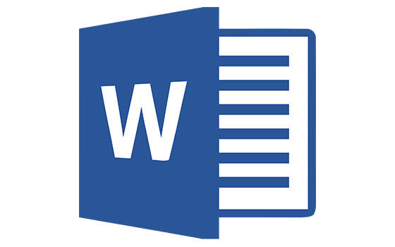

---
format:
  revealjs:
    theme: workshop.scss
    transition: slide
    transition-speed: slow
    slide-number: true
    show-slide-number: print
    scrollable: true
editor: source  
---
# Automatización de referencias con Zotero {background-color="#a81014" .white style="font-size:30px; display:flex; align-items:left; justify-content:center; height:70vh; font-weight:700;"}

 
 

Prof. Juan Carlos Castillo

Departamento de Sociología, Universidad de Chile

 
Presentación para estudiantes ITEP, Septiembre 2026
 

  

## Contenidos 

:::{.incremental style="font-size:55px; font-weight:bold;"}

- 1.- Introducción a Zotero
- 2.- Funcionamiento
- 3.- Citación y bilbiografía automatizada
- 4.- Extras

:::

# Introducción {background-color="#a81014"}

## Referencias: un trabajo de hormiga

:::{.incremental}
- Todo trabajo de investigación necesita un apartado de referencias, el cual usualmente es construido a modo manual

- Elaborar las referencias de esta manera puede transformarse en una tarea laboriosa y, a veces, estresante

- Existen herramientas que pueden amenizar en gran medida este proceso
:::

## Gestores de referencias

:::{.incremental}
- Los software especializados en referencias permiten recolectar, organizar y compartir estos elementos

- A día de hoy, existe una gran oferta en cuanto a programas de referencias bibliográficas: Endnote, Mendeley, Refworks, Zotero

- De aquí en adelante trabajaremos con Zotero, software libre y de código abierto
:::

## Zotero

:::{.incremental}
- Para instalar: [https://www.zotero.org](zotero.org)

- Además, se recomienda instalar su extensión de [Google Chrome](https://chromewebstore.google.com/detail/zotero-connector/ekhagklcjbdpajgpjgmbionohlpdbjgc?utm_source=ext_app_menu), la cual permite integrar referencias con 1 solo click
:::

## Vista general

# Funcionamiento de Zotero {background-color="#a81014"}

:::{.incremental}
- Guardar referencias
- Carpetas y subcarpetas
- Zotero online
- Carpetas compartidas
:::

## Guardar referencias

::::{.columns}
:::{.column width="50%"}
**1) Desde el navegador:**  
Cuando hay una referencia presente en la página, presiona el botón del conector y la referencia se guardará automáticamente  
*(Zotero debe estar abierto)*.
:::

:::{.column width="50%"}
{width=100%}
:::
::::

##

::::{.columns}
:::{.column width="50%"}
**2): Desde Zotero: vía DOI/ISBN/ISSN**
:::

:::{.column width="50%"}
{width=100%}
:::
::::

##

::::{.columns}
:::{.column width="50%"}
**2): Desde Zotero: modo manual**
:::

:::{.column width="50%"}
{width=100%}
:::
::::

## Carpetas y subcarpetas

:::{.incremental}
- Zotero permite organizar las referencias en **colecciones** (carpetas) y **subcolecciones**, tal como en un explorador de archivos

- Una misma referencia puede agregarse a varias carpetas sin duplicarse: la biblioteca general ("Mi biblioteca") siempre contiene todos los ítems

- Es posible arrastrar y soltar referencias entre carpetas, o usar clic derecho > *Add to Collection*

- Recomendación: organizar por proyecto, curso o capítulo de tesis, y usar **etiquetas (tags)** como criterio transversal (ej. método, autor, tema)
:::

## Zotero online

:::{.incremental}
- Al crear una cuenta gratuita en [zotero.org](https://www.zotero.org), la biblioteca local se puede **sincronizar** con la nube

- Ventajas de la sincronización:
  - Acceso a las referencias desde cualquier computador o dispositivo
  - Respaldo automático ante pérdida o cambio de equipo
  - Consulta y edición desde la interfaz web (zotero.org/mylibrary)

- La cuenta gratuita incluye 300 MB de almacenamiento para archivos adjuntos (PDFs); se puede ampliar con planes pagados
:::

## Carpetas compartidas

:::{.incremental}
- Zotero permite crear **bibliotecas de grupo (Group Libraries)** para trabajar en equipo

- Tipos de grupo:
  - *Privado*: solo miembros invitados ven las referencias
  - *Público*: cualquiera puede ver la biblioteca (con o sin unirse)

- Útil para equipos de investigación, seminarios o coordinación de bibliografía de un curso

- Cada integrante mantiene su biblioteca personal además de acceder a las carpetas compartidas del grupo
:::

# Automatización de citación y bibliografía {background-color="#a81014"}

## Contenidos de esta sección

:::{.incremental style="font-size:45px;"}
- Complemento para Word / Google Docs
- Estilos de citación (CSL)
:::

## Complemento para Word / Google Docs

::::{.columns}
:::{.column width="70%"}
:::{.incremental}
- Al instalar Zotero se agrega automáticamente un complemento para **Word** (y existe uno para Google Docs)
- *Add/Edit Citation*: busca al autor, título o año y la cita se inserta con el formato correcto
- *Add/Edit Bibliography*: genera y actualiza la lista de referencias al final del documento
- Si se edita, elimina o reordena una Complemencita, la bibliografía se actualiza automáticamente
:::
:::

:::{.column width="30%"}
{width=100%}
:::
::::

## Estilos de citación (CSL)

:::{.incremental}
- Zotero incluye miles de estilos de citación mediante **Citation Style Language (CSL)**: APA, Chicago, Vancouver, ASA, entre otros
- Se agregan más estilos en *Zotero > Preferencias > Cite > Estilos > Obtener estilos adicionales*
- El estilo elegido se aplica automáticamente a **todas** las citas y a la bibliografía del documento
- Cambiar de estilo (ej. de APA a Vancouver) actualiza el documento completo con un clic
:::

# Extras {background-color="#a81014"}

:::{.incremental style="font-size:45px;"}
- Importar colecciones desde otros gestores
- Conexión con Research Rabbit
:::

## Importar 

:::{.incremental}
- Zotero permite migrar bibliotecas existentes desde *Archivo > Importar...*

- Desde **Mendeley**: Zotero 7 puede importar directamente la base de datos local de Mendeley Desktop; alternativamente, exportar desde Mendeley en formato `.ris` o `.bib`

- Desde **EndNote, Refworks** u otros: exportar la biblioteca en formato estándar (RIS, BibTeX o EndNote XML) e importar el archivo en Zotero

- Al importar, se puede crear una **colección nueva** con los ítems importados, lo que facilita revisar duplicados

- Los duplicados se pueden fusionar desde *Duplicate Items* en el panel izquierdo
:::

## Research Rabbit

:::{.incremental}
- [Research Rabbit](https://www.researchrabbit.ai) es una herramienta gratuita de descubrimiento de literatura: a partir de un conjunto de artículos, sugiere trabajos similares, citados y citantes, y muestra redes de autores

- Se puede **sincronizar con Zotero**: importar colecciones de Zotero como punto de partida y, a la inversa, enviar de vuelta a Zotero los artículos encontrados

- Pasos básicos:
  - Crear una cuenta en Research Rabbit
  - En *Settings / Integrations*, conectar la cuenta de Zotero (autorización vía zotero.org)
  - Importar una colección de Zotero, explorar recomendaciones y agregar los artículos de interés a la colección sincronizada

- Flujo recomendado: **Zotero** (organizar) → **Research Rabbit** (descubrir) → **Zotero** (guardar y citar)
:::

# Más información: [Guía de inicio rápido zotero.org/support/quick_start_guide](https://www.zotero.org/support/quick_start_guide)